# RPGConnect Frontend Documentation

This document provides a detailed overview of the frontend application flow, including user authentication, table management, and in-session interactions.

## 1. Authentication Flow

The authentication flow handles user login, registration, and session management. It is primarily managed by the `useAuth` hook.

### 1.1. Authentication Endpoints

- `GET /api/user`: Fetches the currently authenticated user's data.
- `POST /api/login`: Authenticates a user with email and password.
- `POST /api/register`: Creates a new user account.
- `POST /api/logout`: Clears the user's session.
- `PUT /api/users/:id`: Updates a user's profile information.

### 1.2. Authentication Process Flowchart


### 1.3. Code Snippets

**`useAuth` Hook (`client/src/hooks/use-auth.tsx`)**

```typescript
// Fetching user data
useQuery<SelectUser | undefined, Error>({
  queryKey: ["/api/user"],
  queryFn: getQueryFn({ on401: "returnNull" }),
});

// Login mutation
const loginMutation = useMutation({
  mutationFn: async (credentials: LoginData) => {
    const res = await apiRequest("POST", "/api/login", credentials);
    return await res.json();
  },
  onSuccess: (user: SelectUser) => {
    queryClient.setQueryData(["/api/user"], user);
  },
});

// Registration mutation
const registerMutation = useMutation({
  mutationFn: async (credentials: InsertUser) => {
    const res = await apiRequest("POST", "/api/register", credentials);
    return await res.json();
  },
  onSuccess: (user: SelectUser) => {
    queryClient.setQueryData(["/api/user"], user);
  },
});
```

## 2. Home Page Flow

The home page displays the user's owned and joined tables.

### 2.1. Home Page Endpoints

- `GET /api/tables/owned`: Fetches the tables created by the user.
- `GET /api/tables/joined`: Fetches the tables the user has joined.

### 2.2. Home Page Data Fetching


### 2.3. Code Snippets

**`HomePage` Component (`client/src/pages/home-page.tsx`)**

```typescript
// Fetching owned tables
const { data: ownedTables = [] } = useQuery<Table[]>({
  queryKey: ["/api/tables/owned"],
});

// Fetching joined tables
const { data: joinedTables = [] } = useQuery<Table[]>({
  queryKey: ["/api/tables/joined"],
});
```

## 3. Table Management Flow

This flow describes how users can create new tables or join existing ones.

### 3.1. Table Management Endpoints

- `POST /api/tables`: Creates a new table.
- `POST /api/tables/join`: Joins a table using an access code.

### 3.2. Table Management Flowchart


### 3.3. Code Snippets

**`CreateTableModal` Component (`client/src/components/dashboard/create-table-modal.tsx`)**

```typescript
const createTableMutation = useMutation({
  mutationFn: async (data: CreateTableData) => {
    const res = await apiRequest("POST", "/api/tables", data);
    return await res.json();
  },
  onSuccess: (table) => {
    queryClient.invalidateQueries({ queryKey: ["/api/tables/owned"] });
  },
});
```

**`JoinTableModal` Component (`client/src/components/dashboard/join-table-modal.tsx`)**

```typescript
const joinTableMutation = useMutation({
  mutationFn: async (data: JoinTableData) => {
    const res = await apiRequest("POST", "/api/tables/join", data);
    return await res.json();
  },
  onSuccess: (table) => {
    setLocation(`/session/${table.id}`);
  },
});
```

## 4. Session Page Flow

The session page is where the main gameplay happens. It fetches all the necessary data for the session.

### 4.1. Session Page Endpoints

- `GET /api/tables/:tableId`: Fetches the details of the current table.
- `GET /api/tables/:tableId/characters`: Fetches the list of characters in the table.

### 4.2. Session Page Data Fetching

```mermaid
graph TD
    A[User navigates to Session Page] --> B{User is authenticated};
    B -- Yes --> C[Fetch table and character data];
    C --> D[GET /api/tables/:tableId];
    C --> E[GET /api/tables/:tableId/characters];
    D --> F[Display table information];
    E --> G[Display character list];
    B -- No --> H[Redirect to Auth Page];
```



### 4.3. Code Snippets

**`SessionPage` Component (`client/src/pages/session-page.tsx`)**

```typescript
// Fetching table data
const { data: table } = useQuery<Table>({
  queryKey: ["/api/tables", tableId],
  enabled: !!tableId,
});

// Fetching characters
const { data: characters = [] } = useQuery<Character[]>({
  queryKey: ["/api/tables", tableId, "characters"],
  enabled: !!tableId,
});
```

## 5. Character Management Flow

This flow describes how users can create characters within a session.

### 5.1. Character Management Endpoints

- `POST /api/tables/:tableId/characters`: Creates a new character in a table.

### 5.2. Character Creation Flowchart


### 5.3. Code Snippets

**`CharacterCreationModal` Component (`client/src/components/session/character-creation-modal.tsx`)**

```typescript
const createCharacterMutation = useMutation({
  mutationFn: async (data: CreateCharacterData) => {
    const res = await apiRequest("POST", `/api/tables/${tableId}/characters`, data);
    return await res.json();
  },
  onSuccess: () => {
    queryClient.invalidateQueries({ queryKey: ["/api/tables", tableId, "characters"] });
  },
});
```

## 6. Account Management Flow

The account management flow allows users to update their profile information.

### 6.1. Account Management Endpoints

- `PUT /api/users/:id`: Updates a user's profile information.

### 6.2. Account Update Flowchart


### 6.3. Code Snippets

**`AccountPage` Component (`client/src/pages/account-page.tsx`)**

```typescript
const handleSave = async () => {
  if (user) {
    await updateUserMutation.mutateAsync({ name, email });
    setIsEditing(false);
  }
};
```

**`useAuth` Hook (`client/src/hooks/use-auth.tsx`)**

```typescript
const updateUserMutation = useMutation({
  mutationFn: async (updates: Partial<SelectUser>) => {
    if (!user) throw new Error("User not logged in");
    const res = await apiRequest("PUT", `/api/users/${user.id}`, updates);
    return await res.json();
  },
  onSuccess: (updatedUser: SelectUser) => {
    queryClient.setQueryData(["/api/user"], updatedUser);
  },
});
```
