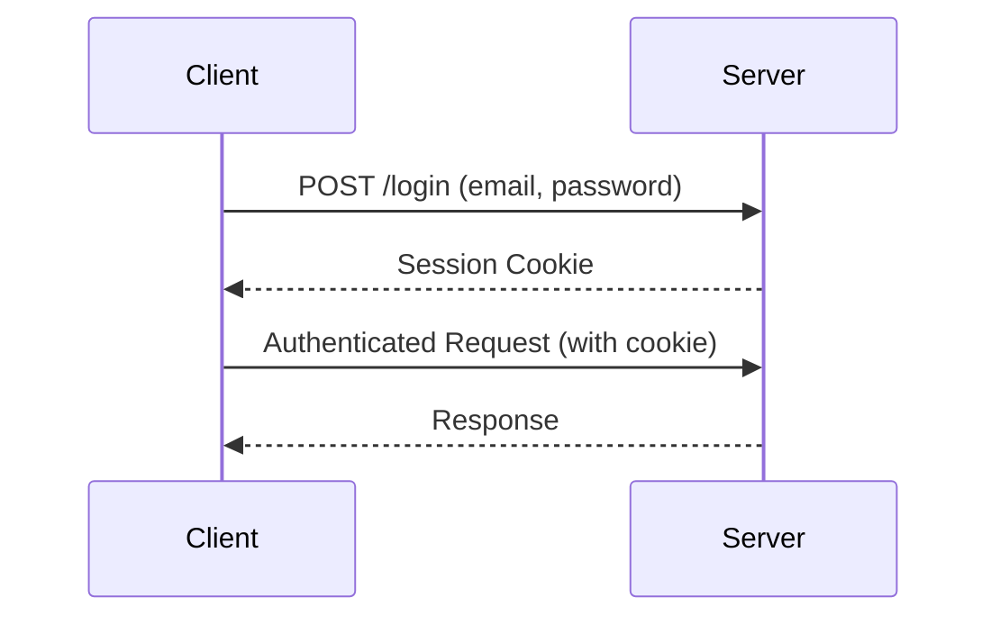

# RPGPlace API Documentation

This document outlines the API endpoints, data structures, and authentication mechanisms for the RPGPlace application.

## Base URL

The base URL for all API endpoints is the root of the application.

## Authentication

The API uses a session-based authentication mechanism.



*   **Login**: To authenticate, send a `POST` request to the `/login` endpoint with the user's `email` and `password` in the request body.
*   **Logout**: To log out, send a request to the `/logout` endpoint.
*   **Protected Endpoints**: All endpoints except for `/auth/register` and `/login` require authentication.

## Endpoints

### Auth Controller

*   **`POST /auth/register`**
    *   **Description**: Registers a new user.
    *   **Request Body**: `RegisterRequestDTO`
    *   **Response**: `UserResponseDTO`

### User Controller

*   **`GET /users`**
    *   **Description**: Retrieves a list of all users.
    *   **Authentication**: Required.
    *   **Response**: `List<UserResponseDTO>`
*   **`GET /users/{id}`**
    *   **Description**: Retrieves a user by their ID.
    *   **Authentication**: Required.
    *   **Path Variable**: `id` (UUID)
    *   **Response**: `UserResponseDTO`
*   **`PUT /users/{id}`**
    *   **Description**: Updates a user by their ID.
    *   **Authentication**: Required.
    *   **Path Variable**: `id` (UUID)
    *   **Request Body**: `UserRequestDTO`
    *   **Response**: `UserResponseDTO`
*   **`DELETE /users/{id}`**
    *   **Description**: Deletes a user by their ID.
    *   **Authentication**: Required.
    *   **Path Variable**: `id` (UUID)
    *   **Response**: `204 No Content`

### Character Controller

*   **`POST /characters`**
    *   **Description**: Creates a new character.
    *   **Authentication**: Required.
    *   **Request Body**: `CharacterRequestDTO`
    *   **Response**: `CharacterResponseDTO`
*   **`GET /characters`**
    *   **Description**: Retrieves a list of all characters.
    *   **Authentication**: Required.
    *   **Response**: `List<CharacterResponseDTO>`
*   **`GET /characters/{id}`**
    *   **Description**: Retrieves a character by its ID.
    *   **Authentication**: Required.
    *   **Path Variable**: `id` (UUID)
    *   **Response**: `CharacterResponseDTO`
*   **`PUT /characters/{id}`**
    *   **Description**: Updates a character by its ID.
    *   **Authentication**: Required.
    *   **Path Variable**: `id` (UUID)
    *   **Request Body**: `CharacterRequestDTO`
    *   **Response**: `CharacterResponseDTO`
*   **`DELETE /characters/{id}`**
    *   **Description**: Deletes a character by its ID.
    *   **Authentication**: Required.
    *   **Path Variable**: `id` (UUID)
    *   **Response**: `204 No Content`

### Table Controller

*   **`POST /tables`**
    *   **Description**: Creates a new table.
    *   **Authentication**: Required.
    *   **Request Body**: `TableRequestDTO`
    *   **Response**: `TableResponseDTO`
*   **`GET /tables`**
    *   **Description**: Retrieves a list of all tables.
    *   **Authentication**: Required.
    *   **Response**: `List<TableResponseDTO>`
*   **`GET /tables/owned`**
    *   **Description**: Retrieves the tables owned by the authenticated user.
    *   **Authentication**: Required.
    *   **Response**: `List<TableResponseDTO>`
*   **`GET /tables/joined`**
    *   **Description**: Retrieves the tables the authenticated user has joined.
    *   **Authentication**: Required.
    *   **Response**: `List<TableResponseDTO>`
*   **`POST /tables/join`**
    *   **Description**: Joins a table using an access code.
    *   **Authentication**: Required.
    *   **Request Body**: `JoinRequestDTO`
    *   **Response**: `TableResponseDTO`
*   **`GET /tables/{id}`**
    *   **Description**: Retrieves a table by its ID.
    *   **Authentication**: Required.
    *   **Path Variable**: `id` (UUID)
    *   **Response**: `TableResponseDTO`
*   **`PUT /tables/{id}`**
    *   **Description**: Updates a table by its ID.
    *   **Authentication**: Required.
    *   **Path Variable**: `id` (UUID)
    *   **Request Body**: `TableRequestDTO`
    *   **Response**: `TableResponseDTO`
*   **`DELETE /tables/{id}`**
    *   **Description**: Deletes a table by its ID.
    *   **Authentication**: Required.
    *   **Path Variable**: `id` (UUID)
    *   **Response**: `204 No Content`
*   **`GET /tables/{tableId}/characters`**
    *   **Description**: Retrieves the characters associated with a specific table.
    *   **Authentication**: Required.
    *   **Path Variable**: `tableId` (UUID)
    *   **Response**: `List<CharacterResponseDTO>`
*   **`POST /tables/{tableId}/characters`**
    *   **Description**: Creates a new character for a specific table.
    *   **Authentication**: Required.
    *   **Path Variable**: `tableId` (UUID)
    *   **Request Body**: `CharacterRequestDTO`
    *   **Response**: `CharacterResponseDTO`

## Data Transfer Objects (DTOs)

### Request DTOs

*   **`RegisterRequestDTO`**
    ```json
    {
      "name": "string",
      "email": "string",
      "password": "string"
    }
    ```
*   **`UserRequestDTO`**
    ```json
    {
      "name": "string",
      "email": "string",
      "password": "string"
    }
    ```
*   **`CharacterRequestDTO`**
    ```json
    {
      "name": "string",
      "health": "integer",
      "mana": "integer",
      "strength": "integer",
      "agility": "integer",
      "intelligence": "integer",
      "userId": "UUID",
      "tableId": "UUID"
    }
    ```
*   **`TableRequestDTO`**
    ```json
    {
      "title": "string",
      "rulebook": "string",
      "accessCode": "string",
      "masterId": "UUID"
    }
    ```
*   **`JoinRequestDTO`**
    ```json
    {
      "accessCode": "string"
    }
    ```

### Response DTOs

*   **`UserResponseDTO`**
    ```json
    {
      "id": "UUID",
      "name": "string",
      "email": "string",
      "createdAt": "OffsetDateTime",
      "updatedAt": "OffsetDateTime"
    }
    ```
*   **`CharacterResponseDTO`**
    ```json
    {
      "id": "UUID",
      "name": "string",
      "health": "integer",
      "mana": "integer",
      "strength": "integer",
      "agility": "integer",
      "intelligence": "integer",
      "userId": "UUID",
      "tableId": "UUID",
      "createdAt": "OffsetDateTime",
      "updatedAt": "OffsetDateTime"
    }
    ```
*   **`TableResponseDTO`**
    ```json
    {
      "id": "UUID",
      "title": "string",
      "rulebook": "string",
      "accessCode": "string",
      "masterId": "UUID",
      "createdAt": "OffsetDateTime",
      "updatedAt": "OffsetDateTime"
    }
    ```
